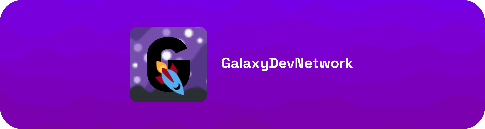

# GalaxyDevNetwork 🌌 🖥️ 🌐

## What is this?
GalaxyDevNetwork is a Multiverses with Universes that have Galaxies, let's say meme20200, the popular universe in GalaxyDevNetwork is meme20200,
meme20200 has Galaxies like `meme20200 Wiki`, `meme20200 Teams`, some Universes do not have Galaxies like GalaxyDev.

## Are these Universes & Galaxies real in Real Life?
Nope I wish they were real Universes & Galaxies but no they are just other names to replace the boring child and parents and make it more Space-themed

## Licensing
All Repositories in GalaxyDevNetwork's Github are all under [CC BY](https://creativecommons.org/licenses/by/4.0/) License. You can freely use the work but must credit GalaxyDevNetwork

Some repositories are not under the license like:
Docs (reason: Uses a template of [Mintlify](https://mintlify.com))

All Logos that are created by GalaxyDevNetwork including: [GalaxyDevNetwork, GalaxyDevNetwork Docs, meme20200, meme20200 Wiki, meme20200 Discord, GalaxyDev] are under the [CC BY-NC-ND 4.0 License](https://creativecommons.org/licenses/by-nc-nd/4.0/) 
